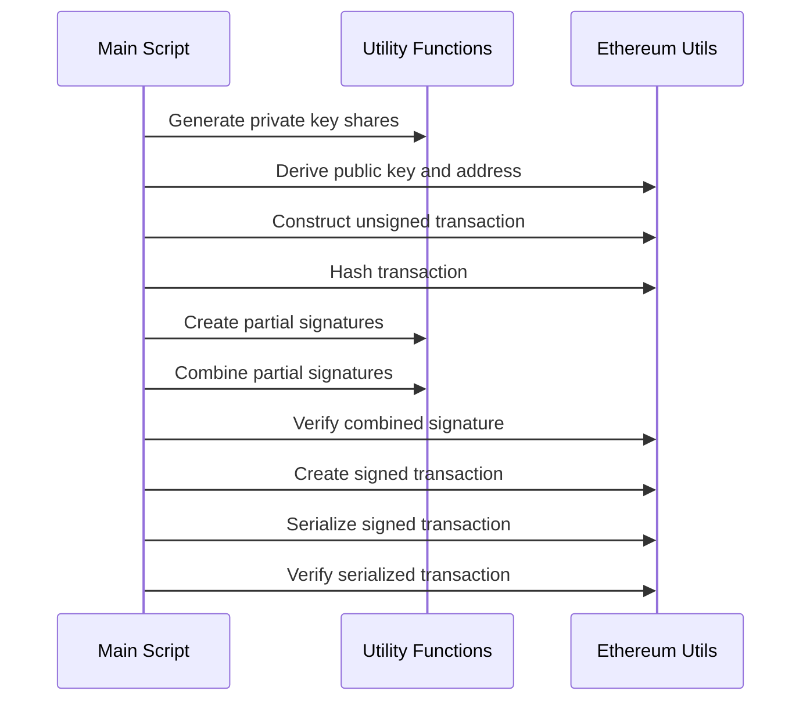

# Threshold Signature Scheme for Ethereum Transactions

## Project Description

This project implements a threshold signature scheme for Ethereum transactions using JavaScript. The scheme allows multiple parties to collectively sign a transaction without any single party having access to the full private key. This approach enhances security by distributing trust among multiple participants.

## Context

In traditional cryptocurrency wallets, a single private key is used to sign transactions. This creates a single point of failure - if the private key is compromised, an attacker gains full control over the funds. Threshold signatures mitigate this risk by splitting the private key into multiple shares, requiring a minimum number of shares (the threshold) to create a valid signature.

This implementation uses Shamir's Secret Sharing to split the private key and a threshold signature scheme based on ECDSA (Elliptic Curve Digital Signature Algorithm) for Ethereum transactions.

## Main Components

1. `util.js`: Contains utility functions for generating key shares, creating partial signatures, and combining signatures.
2. `index.js`: The main script that demonstrates the full workflow of the threshold signature scheme.

## Sequence Diagram

## Workflow Explanation

1. **Split Private Key**: The private key is split into shares using Shamir's Secret Sharing.
2. **Generate Shares**: The `generateShares` function creates multiple shares of the private key.
3. **Construct Transaction**: An unsigned Ethereum transaction is constructed with specified parameters.
4. **Serialize Unsigned Transaction**: The unsigned transaction is serialized.
5. **Create Partial Signatures**: Each share holder creates a partial signature of the transaction hash.
6. **Combine Signatures**: The partial signatures are combined to create a full signature.
7. **Sign Transaction**: The combined signature is used to sign the transaction.
8. **Serialize Signed Transaction**: The signed transaction is serialized for broadcasting to the Ethereum network.

## Usage

To run the demonstration:

1. Ensure you have Node.js installed.
2. Install dependencies: `npm install`
3. Run the script: `node index.js`

## Future Improvements

- Add network layer for coordinating between share holders.
- Construct the shares by skipping the construction of the private key entirely, enhancing security by never creating a complete private key at any point in the process.